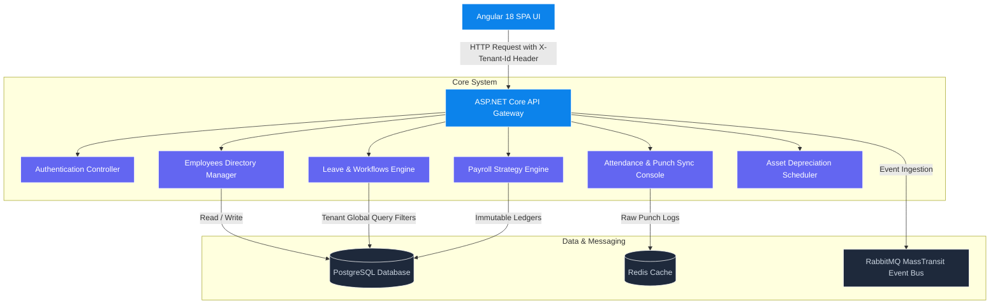

# Enterprise HRMS & Payroll Platform (Production-Grade SaaS Core)

An enterprise-grade, multi-tenant Human Resource Management System (HRMS) and Payroll Platform built with **ASP.NET Core 8**, **Angular 18**, **PostgreSQL**, **Redis**, and **RabbitMQ**. 

The system features real-time biometric tracking emulation, automated tax strategy calculators, multi-level leave workflow approvals, hardware asset registries, and high-fidelity SVG interactive visualizations using ApexCharts—all encapsulated in a stunning dark-mode glassmorphic interface.

---

## 🏗️ System Architecture

The platform is designed around a **Modular Monolith** architecture with clean, domain-driven boundaries, preparing it for a microservices transition via event-driven messaging.



### Core Architecture Specifications:
1. **Logical Data Isolation (SaaS Multi-Tenancy)**:
   - All browser requests carry an `X-Tenant-Id` header resolved from the user's active tenant session.
   - EF Core applies a **Global Query Filter** automatically to all SQL queries:
     ```csharp
     modelBuilder.Entity<Employee>().HasQueryFilter(e => e.TenantId == _tenantProvider.CurrentTenantId);
     ```
2. **PostgreSQL Case-Folding Naming Mapper**:
   - Resolves native case-sensitivity mismatches between unquoted PostgreSQL database schemas and quoted EF Core property queries by dynamically mapping all entity table and column keys to absolute lower-invariant format.
3. **GAAP Audit Trail Compliance**:
   - Ledger records are structurally immutable. Hard deletes are prevented. Corrections are recorded using balancing negative offsets.

---

## 💎 Core Modules & Features

### 1. 🏝️ Leave & Workflow Management
* **Employee portal**: Form submissions checking available balance limits and executing **date overlap validation guards**.
* **HR Manager inbox**: Multi-level workflow routing where only users with the **HR** role hold write permissions to approve/reject requests.
* **Aesthetics**: Radial Bar Gauges representing available leave balances (Casual, Sick, Earned, PTO) relative to annual allocations.

### 2. 📅 Attendance Tracker & Terminal
* **Dual Punches**: Punch IN / Punch OUT terminal with a real-time ticking active work session clock.
* **Conflict Guard**: Enforces a 60-second duplicate punch limit to prevent double-clicks or sensor errors.
* **Sync & Consolidation**: Consolidates raw biometric/web punch records by business date, computing standard hours vs. overtime minutes, and tolerance thresholds.
* **Dynamic Profile Resolution**: Automatically queries the active employee catalog by the current user's email to fetch and save punch cards for both employees and HR.

### 3. 💳 Payroll Automation Engine
* **Regional Tax Strategies**: Executes country-specific tax computations for **India (₹)**, **US ($)**, **UK (£)**, and **UAE (AED)**.
* **Tax Slabs**: Computes standard deductions, professional tax, FICA (7.65%), national insurance (8%), and provident fund contributions (12%).
* **Ledger**: Displays a reactive donut chart breakdown mapping take-home net salary against tax strategy deductions.

### 4. 💻 Asset Depreciation Scheduler
* Directory catalog tracking assigned hardware inventory.
* Straight-Line depreciation formula widget tracking valuations over time:
  $$\text{Current Value} = \text{Purchase Cost} - (\text{Annual Depreciation Rate} \times \text{Asset Age in Years})$$

---

## 🚀 How to Run the Project

### System Prerequisites:
To execute this platform, you must have the following installed on your host:
* **Docker Desktop** (Or a running Docker Engine with compose capabilities)
* **Node.js v20+** (Optional: only needed if running outside containers)
* **.NET 8.0 SDK** (Optional: only needed if running outside containers)

---

### Method A: Running the Production Stack (Recommended)
This launches the entire 5-container enterprise stack virtualized in Docker. It builds the Angular Angular-Nginx production build, mounts the pre-seeded PostgreSQL schema database, and sets up active messaging queues and caches.

1. **Start the Stack**:
   Open a terminal in the root directory of the project and execute:
   ```bash
   docker-compose up --build -d
   ```
2. **Active Containers**:
   Verify that all five containers are running successfully:
   - `hrms-frontend-ui` 🟢 Up (Listening on `http://localhost:4200` & `http://localhost:80`)
   - `hrms-backend-api` 🟢 Up (Listening on `http://localhost:5000`)
   - `hrms-db` 🟢 Up & Healthy (PostgreSQL on `5432`)
   - `hrms-messaging` 🟢 Up (RabbitMQ active on `5672` / `15672`)
   - `hrms-cache` 🟢 Up (Redis active on `6379`)
3. **Launch the Portal**:
   Navigate to **[http://localhost:4200](http://localhost:4200)** in your browser.

---

### Method B: Running in Local Development Mode
If you wish to modify the code locally with active hot-reloads (watch modes), you can launch the servers directly on your host machine while keeping database/cache services inside Docker.

1. **Boot Database and Caches in Docker**:
   ```bash
   docker-compose up -d db cache messaging
   ```
2. **Launch ASP.NET Core Backend**:
   Navigate to the backend directory and run:
   ```bash
   cd backend
   dotnet run
   ```
   *The local API will start listening on `http://localhost:5000`.*
3. **Launch Angular Development Server**:
   Navigate to the frontend directory, install npm packages, and start the development hot-rebuild server:
   ```bash
   cd frontend
   npm install --legacy-peer-deps
   npx ng serve --open
   ```
   *The Angular server will automatically open your default browser at `http://localhost:4200`.*

---

## 🔑 Default Seed Test Accounts

The database is pre-seeded with sample companies and organizational users. The backend development auth server parses roles dynamically by email keywords and accepts **any password** as long as it is not blank.

### 🇮🇳 Tenant: Capgemini India (Select from Login Dropdown)
| Name | Role | Email Credentials | Password | Key Permissions |
| :--- | :--- | :--- | :--- | :--- |
| **HR Manager** | HR / Manager | `hr@capgemini-in.com` | *Any password* (e.g. `Admin@1234`) | Tenant-level operations: manages employee directory, runs payroll, registers assets, performs web punches, **approves leave requests**. |
| **Employee 1** | Employee | `amit.sharma@capgemini-in.com` | *Any password* (e.g. `Password123`) | Submits leave requests, performs web punches, views personal balances. |
| **Employee 2** | Employee | `rajesh.kumar@capgemini-in.com` | *Any password* (e.g. `Password123`) | Submits leave requests, performs web punches, views personal balances. |
| **Super Admin** | SuperAdmin | `hr.admin@capgemini-in.com` | *Any password* (e.g. `Admin@1234`) | System-level maintenance: registers new Tenants, adds/manages HR and Employees globally. |

### 🇺🇸 Tenant: Capgemini USA (Select from Login Dropdown)
| Name | Role | Email Credentials | Password | Key Permissions |
| :--- | :--- | :--- | :--- | :--- |
| **Sarah Connor** | HR / Employee | `sarah.connor@capgemini-us.com` | *Any password* | US-based HR operator & Employee hybrid access. |
| **John Doe** | Employee | `john.doe@capgemini-us.com` | *Any password* | US regular employee punches and leave submittals. |

---

## 📂 Codebase Directory Layout

```
.
├── backend/                       # ASP.NET Core 8 Backend Application
│   ├── src/
│   │   ├── HRMS.API/             # Controllers, Auth, Gateway entry point
│   │   ├── HRMS.Application/     # Application logic, DTOs, Handlers
│   │   ├── HRMS.Core/            # Domain entities, Domain interfaces
│   │   └── HRMS.Infrastructure/  # EF Core, PostgreSQL Context, Redis/RabbitMQ clients
│   └── Dockerfile                # Multi-stage .NET API Dockerfile
│
├── database/                      # Pre-seeded schemas
│   └── init.sql                  # PostgreSQL pre-seeded tables and indices
│
├── frontend/                      # Angular 18 Single Page Application
│   ├── src/
│   │   ├── app/
│   │   │   ├── core/             # Auth Guards, services, Http Interceptors
│   │   │   ├── features/         # Dashboard, Leave, Attendance, Payroll, Assets, Tenants
│   │   │   ├── layouts/          # Premium side nav templates
│   │   │   └── shared/           # Directives, models, UI modules
│   │   └── styles.css            # Tailored Tailwind and glassmorphism styling
│   └── Dockerfile                # Multi-stage Angular-Nginx SPA Dockerfile
│
└── docker-compose.yml             # System orchestrator compose configuration
```

---

## 🛠️ Key Troubleshooting Configurations

* **Case-Sensitivity Crashes**:
  PostgreSQL automatically folds unquoted columns to lowercase, which conflicts with Npgsql's quoted uppercase query formats (e.g. `o."Id"`). We resolved this globally inside `OnModelCreating` in `ApplicationDbContext.cs` to ensure case-insensitive routing.
* **Nginx SPA Routing**:
  The production Angular Docker container utilizes Nginx. We configured `nginx.conf` with a custom `try_files $uri $uri/ /index.html` fallback rule. This ensures that direct page reloads or deep-linking routes do not return `404 Not Found` errors.
* **Kestrel inside Docker Virtual Networks**:
  To host Kestrel in Docker without needing active mounted SSL certificates on port 5001, we bind local virtual network routing to HTTP on port 5000 via the `ASPNETCORE_URLS` parameter.
